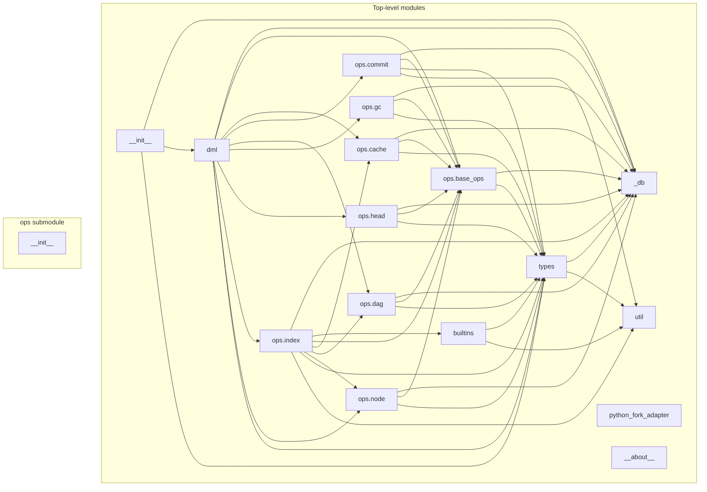

# Module Import Graph

This document describes the import relationships between modules in the `daggerml_cli` package.

## Mermaid Chart

## Detailed Description

### Top-level modules

### daggerml_cli.__init__
Imports:
- daggerml_cli._db (Ref, Resource)
- daggerml_cli.dml (Dml)
- daggerml_cli.types (...)

### daggerml_cli.dml
Imports:
- daggerml_cli._db (DmlDbEnv, Ref)
- daggerml_cli.ops.base_ops (BaseOps)
- daggerml_cli.ops.cache (CacheOps)
- daggerml_cli.ops.commit (CommitOps)
- daggerml_cli.ops.dag (DagOps)
- daggerml_cli.ops.gc (GcOps)
- daggerml_cli.ops.head (HeadOps)
- daggerml_cli.ops.index (IndexOps)
- daggerml_cli.ops.node (NodeOps)
- daggerml_cli.types (...)

### daggerml_cli.types
Imports:
- daggerml_cli._db (Ref, Resource)
- daggerml_cli.util (now)

### daggerml_cli.util
Imports: None

### daggerml_cli.builtins
Imports:
- daggerml_cli.types (NONE)
- daggerml_cli.util (unnest)

### daggerml_cli.python_fork_adapter
Imports: None

### daggerml_cli._db
Imports: None

### daggerml_cli.__about__
Imports: None

## ops submodule

### daggerml_cli.ops.__init__
Imports: None

### daggerml_cli.ops.base_ops
Imports:
- daggerml_cli._db (...)
- daggerml_cli.types (...)

### daggerml_cli.ops.cache
Imports:
- daggerml_cli._db (...)
- daggerml_cli.ops.base_ops (BaseOps)
- daggerml_cli.types (Cache, DmlRepoError)

### daggerml_cli.ops.commit
Imports:
- daggerml_cli._db (Ref)
- daggerml_cli.ops.base_ops (BaseOps)
- daggerml_cli.types (...)
- daggerml_cli.util (now)

### daggerml_cli.ops.dag
Imports:
- daggerml_cli._db (Ref)
- daggerml_cli.ops.base_ops (BaseOps)
- daggerml_cli.types (DmlRepoError)

### daggerml_cli.ops.gc
Imports:
- daggerml_cli._db (Ref)
- daggerml_cli.ops.base_ops (BaseOps)
- daggerml_cli.types (DmlRepoError)

### daggerml_cli.ops.head
Imports:
- daggerml_cli._db (Ref)
- daggerml_cli.ops.base_ops (BaseOps)
- daggerml_cli.types (DmlRepoError, Head)

### daggerml_cli.ops.index
Imports:
- daggerml_cli._db (Ref, Resource)
- daggerml_cli.builtins (BUILTIN_FNS)
- daggerml_cli.ops.base_ops (BaseOps)
- daggerml_cli.ops.cache (CacheOps)
- daggerml_cli.ops.dag (DagOps)
- daggerml_cli.ops.node (NodeOps)
- daggerml_cli.types (...)
- daggerml_cli.util (now)

### daggerml_cli.ops.node
Imports:
- daggerml_cli._db (Ref)
- daggerml_cli.ops.base_ops (BaseOps)
- daggerml_cli.types (Datum, DmlRepoError, Node)